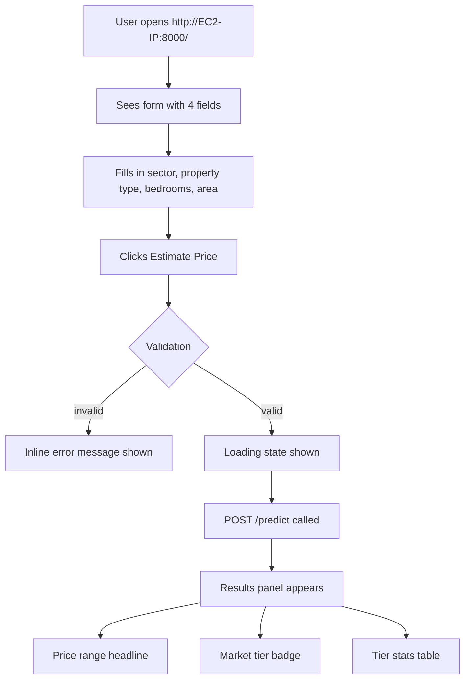

# Frontend: House Price Prediction Web UI

## Problem Frame

The prediction API exists and works, but requires `curl` or Swagger to query. General
public users — anyone curious about Santo Domingo house prices — have no accessible way
to use it. A simple web form served from the same EC2 instance removes that barrier with
no additional infrastructure.

## User Flow

## Requirements

**Form**
- R1. A single-page form with four fields: Sector (text), Property Type (dropdown: apartment / house), Bedrooms (integer ≥ 1), Area m² (positive number).
- R2. Client-side validation before submission: all fields required, bedrooms ≥ 1, area > 0. Inline error messages shown per field.
- R3. A submit button labeled "Estimate Price" that triggers the API call.
- R4. While the request is in-flight, the button shows a loading state and is disabled.

**Results**
- R5. After a successful response, display the estimated price range as the headline (e.g. "US$140,000 — US$180,000").
- R6. Display the market tier (Budget / Mid-Range / Luxury) as a visually distinct colored badge.
- R7. Display tier statistics below the badge: price range, area range, and bedroom range typical for that tier.
- R8. Results replace a placeholder area on the same page — no navigation or page reload.

**Error handling**
- R9. If the API returns any non-2xx response or a network failure, display a user-friendly message (not a raw JSON dump).

**Serving**
- R10. The page is served by FastAPI at `GET /` on the same server and port (8000). No separate hosting required.
- R11. The page is self-contained: HTML + inline CSS + inline JS, no build step, no external frameworks or CDN dependencies.

**Presentation**
- R12. The page is titled "Santo Domingo House Price Estimator" and is readable on both desktop and mobile.
- R13. The tier badge color reflects the tier: green for Budget, blue for Mid-Range, gold/amber for Luxury.

## Success Criteria

- A non-technical user can open the page, fill in the form, and read a price estimate without any instructions.
- The page works from any network once the EC2 security group allows port 8000.
- No additional servers, build tools, or deployment steps are needed beyond what already exists.

## Scope Boundaries

- No HTTPS / custom domain — HTTP on port 8000 only (matches existing API scope).
- No prediction history, saved searches, or user accounts.
- No interactive map or autocomplete for sectors.
- No React, Vue, or other frontend framework — plain HTML/JS only.
- No separate deployment pipeline; the frontend ships as part of the same FastAPI app.
- The existing `/predict`, `/health`, and `/docs` routes are unchanged.

## Key Decisions

- **FastAPI serves the HTML at `GET /` via `HTMLResponse`**: Simplest path — no new server, no CORS, one deployment. `HTMLResponse` from a route handler is preferred over `StaticFiles` because it avoids a filesystem path dependency on the Supervisor working directory and cannot silently shadow other API routes (`/predict`, `/health`, `/docs`).
- **Inline CSS + JS, no build step**: Eliminates Node.js, npm, bundlers, and build-step complexity. A single self-contained HTML string is all that needs to be deployed.
- **Client-side `fetch` to `/predict` directly — no helper wrapper**: The page calls the API from the browser using the native `fetch` API with no abstraction layer. Same origin, no CORS needed. A wrapper over a single call site earns nothing.
- **Inline JS uses only native browser APIs**: No external libraries, no CDN imports. `fetch`, DOM manipulation, and event listeners only.

## Dependencies / Assumptions

- The EC2 instance already has the FastAPI server running with Supervisor.
- Port 8000 is already open in the EC2 Security Group.
- `fastapi` already supports `HTMLResponse` and `StaticFiles` — no new Python dependencies needed.

## Outstanding Questions

### Deferred to Planning

- [Affects R5–R7][Technical] Exact display format for prices (currency symbol, thousands separator, k-suffix), area (m² unit), and bedrooms — resolve during implementation, using `chatbot/chat.py:display_tier()` as the reference format.

## Next Steps

→ `/ce:plan` for structured implementation planning
