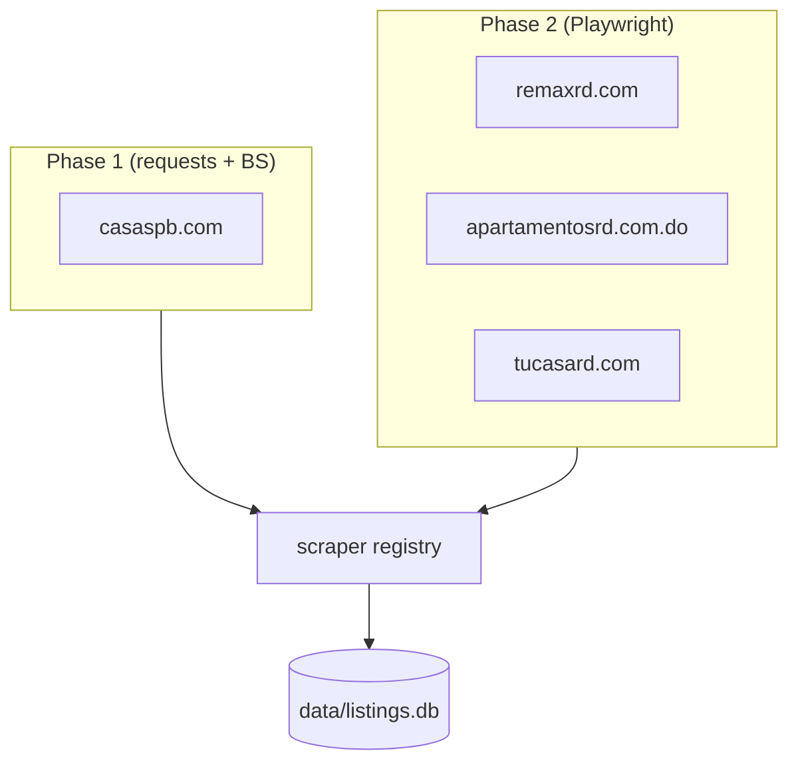

# Remaining Scrapers: casaspb + Phase 2 Sites

## Problem Frame

6 of 10 aspirational DR real estate sites are scraping successfully. The remaining 4 were
deferred: casaspb.com (Phase 1, held as a trivial EasyBroker clone) and remaxrd.com,
apartamentosrd.com.do, tucasard.com (Phase 2, JS-rendered). This work completes the full
aspirational 10-site roster and maximises the training data pool available to `ml/train.py`.

## Data Flow

## Requirements

**casaspb.com — Phase 1**
- R1. Add `scraper/sites/casaspb.py` using the EasyBroker pattern documented in the spike.
  Selectors: card=`div.thumbnail`, price=`span.listing-type-price`,
  location=`div.caption > span`, anchor=`a.related-property[href*="/property/"]`.
  Pagination: `/properties?page=N&web_page=properties` (~149 pages). Base URL: `https://www.casaspb.com`.
  Non-USD listings (DOP/RD$) are skipped.
- R2. Wire `casaspb` into the registry in `scraper/__main__.py`, replacing the deferred comment.

**Playwright dependency**
- R3. Add `playwright` to `requirements.txt`. Browser binaries are installed locally via
  `playwright install chromium` (a one-time developer setup step, not automated by pip).
  EC2 does not run the scraper; Playwright binaries are not required there.

**remaxrd.com — Phase 2**
- R4. Add `scraper/sites/remaxrd.py` using Playwright sync API. Targets the `/propiedades`
  listing page after JS renders. Extracts: price (USD), sector, property_type, bedrooms,
  area_m2. CSS selectors are to be discovered during planning via live Playwright inspection.
  Non-USD listings skipped.

**apartamentosrd.com.do + tucasard.com — Phase 2 (Domiclick platform)**
- R5. Add `scraper/sites/apartamentosrd.py` and `scraper/sites/tucasard.py`. Both sites run on
  the same Domiclick platform and share the same rendered DOM structure. The two modules may
  share a common helper or base function parameterised by base URL — implementation approach
  is deferred to planning.
- R6. Wire `remaxrd`, `apartamentosrd`, `tucasard` into the registry in `scraper/__main__.py`,
  replacing the deferred comments.

**Integration**
- R7. All new `scrape()` functions conform to the existing interface: return `list[dict]` with
  keys `price` (USD int), `sector` (str), `property_type` (`apartment` or `house`), `bedrooms`
  (int), `area_m2` (float), `source_url` (str). Listings missing any field or priced in DOP are
  skipped and logged.
- R8. Playwright scrapers include `time.sleep(1)` between page fetches, matching the convention
  in requests-based scrapers.
- R9. A Playwright scraper failure (network error, selector miss, anti-bot block) is caught,
  logged at error level, and does not abort the run — same resilience contract as R4 in the
  original webcrawler requirements.

## Success Criteria
- `python -m scraper scrape` reports "Scraped 10 of 10 sites; 0 failed." on a clean network run
- casaspb.com inserts listings on first run and deduplicates on subsequent runs
- remaxrd.com, apartamentosrd.com.do, and tucasard.com each return ≥1 listing per run
- All new listings land in `data/listings.db` with correct `source_url` deduplication
- `python -m scraper export` + `python -m ml.train` complete without errors after a scrape

## Scope Boundaries
- No changes to `ml/train.py`, `api.py`, or the 5-field DB schema
- No headless browser required on EC2 — scraping remains a local developer workflow
- No new data fields beyond the existing 5 training features (`price`, `sector`,
  `property_type`, `bedrooms`, `area_m2`). `source_url` is an existing DB field present in
  all current scrapers and is not a new addition.
- No scrape scheduling or automation
- DOP/RD$ listings continue to be skipped across all sites

## Key Decisions
- **playwright to requirements.txt**: Keeps a single requirements file. EC2 installs the
  Python package but never runs the scraper or browser binaries.
- **Same `scrape()` interface for Playwright modules**: Registry dispatcher in `__main__.py`
  doesn't care what's inside each module. Playwright complexity is encapsulated per-site.
- **Domiclick shared helper**: apartamentosrd and tucasard run the same platform — one base
  implementation with URL parameterisation avoids duplicated Playwright logic. Exact
  factoring deferred to planning.

## Dependencies / Assumptions
- `playwright` Python package is not yet in `requirements.txt` (verified).
- Phase 2 CSS selectors are not yet known — they must be discovered during planning via live
  Playwright page inspection (see Deferred to Planning).
- casaspb.com selectors are documented in `docs/plans/spike-results.md` and considered stable
  enough to implement without re-spiking.
- The scraper runs locally only. EC2 Terraform provisioning does not need to change.

## Outstanding Questions

### Resolve Before Planning
*(none)*

### Deferred to Planning
- [Affects R4][Needs research] remaxrd.com: what are the rendered CSS selectors for listing
  cards, price, sector, bedrooms, area_m2, and anchor href? What is the pagination mechanism
  after JS renders?
- [Affects R5][Needs research] Domiclick platform (apartamentosrd.com.do / tucasard.com):
  what are the rendered selectors and pagination mechanism? Are the two sites structurally
  identical beyond base URL?
- [Affects R4, R5][Technical] Do any Phase 2 sites present a CAPTCHA or bot-detection layer
  that blocks even a headless Playwright browser? If so, site is demoted to Blocked.
- [Affects R5][Technical] Best factoring for the shared Domiclick helper: shared module in
  `scraper/sites/_domiclick.py`, or inline duplication across the two modules?

## Next Steps
→ `/ce:plan` for structured implementation planning
