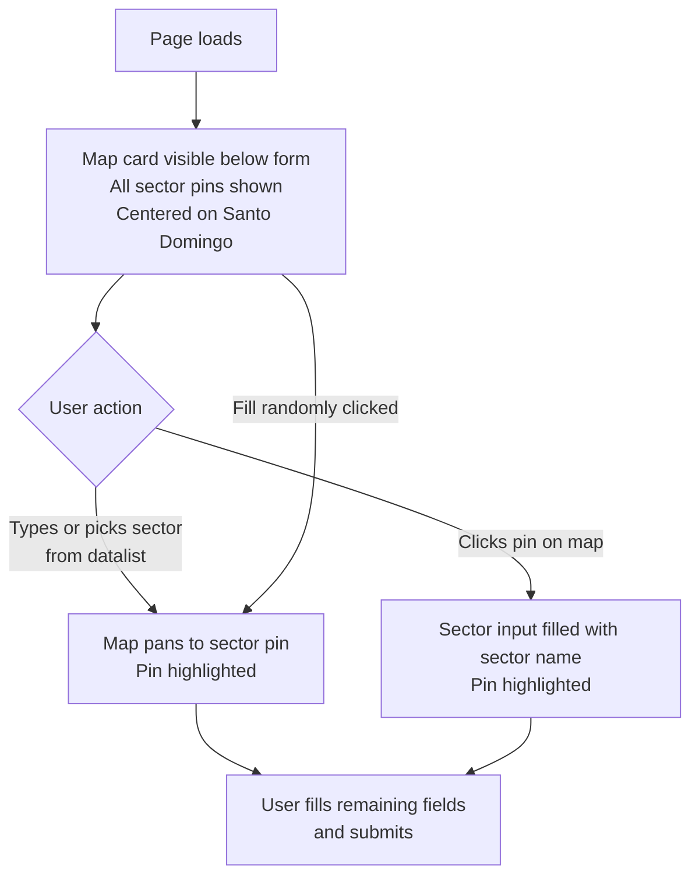

# Sector Map — Google Maps Integration

## Problem Frame

The sector field is a free-text input backed by a datalist. Users who are unfamiliar with Santo
Domingo neighborhoods have no visual reference for what "Piantini" or "Naco" mean geographically.
Adding a bidirectional map panel lets users orient themselves spatially and select sectors by
clicking rather than typing, reducing friction and improving confidence in their input.

## User Flow

## Requirements

**Map Panel**

- R1. A Google Maps panel is rendered in a card below the form card, always visible on page load.
- R2. On load, the map is centered on Santo Domingo, DR at a zoom level that shows all sector pins. If the sector input already contains a recognized sector value on page load (e.g., browser autofill), the map initializes centered on that sector's pin instead.
- R3. Each known sector (from the `SECTORS` global) is represented by a pin at its geocoded location. Sectors without a resolvable coordinate are omitted silently.
- R4. Pins are visually uniform by default; the currently selected sector's pin is styled distinctly (e.g., different color or larger).

**Form → Map**

- R5. When the sector input value changes to a value that matches a known sector (exact match; the datalist always supplies canonical casing), the map pans to and highlights that sector's pin. If the matched sector has no coordinate, R6 behavior applies instead (map returns to overview).
- R6. When the sector input is cleared or holds an unrecognized value, the map returns to the default Santo Domingo overview with all pins visible and no pin highlighted.
- R7. The "Fill randomly" button triggers the same map update as manual sector selection (R5).

**Map → Form**

- R8. Clicking a sector pin fills the sector input with that sector's name and triggers the same map highlight behavior as R5.

**Sector Coordinates**

- R9. The sector-to-coordinate mapping is served with the page so no geocoding API calls are made at runtime. The mapping is a static lookup (sector name → lat/lng). Coordinates are resolved on a best-effort basis before deploy; sectors without a resolvable coordinate are silently omitted from the map per R3 and remain valid form inputs.

**Infrastructure**

- R10. A Google Maps JavaScript API key is required to load the Maps SDK. The key is injected into the page HTML server-side (same pattern as `SECTORS` injection); it is not committed to source code.

## Success Criteria

- Once the map has finished loading, sector selection pans to and highlights the correct pin without any additional API call (coordinate lookup is synchronous from pre-baked data).
- Clicking any sector pin fills the sector input correctly and highlights the pin.
- The "Fill randomly" button updates both the form and the map.
- On mobile, the map is usable without horizontal scroll.
- No Google Maps API calls are made for geocoding at runtime (coordinates are pre-baked).

## Scope Boundaries

- No sector polygon boundaries — only point pins.
- No map-based filtering or browsing beyond sector selection.
- No geocoding API calls at user request time — coordinates are static.
- The map does not affect the prediction logic or API in any way.
- Sectors with no resolvable coordinate are silently excluded from the map; the form still accepts them.

## Key Decisions

- **Pins for known sectors only**: The model only knows specific sector names. Allowing free map clicks with reverse geocoding could produce names the model has never seen. Restricting to known-sector pins guarantees every map selection is a valid model input.
- **Always-visible map**: Showing the map on load (not only after sector selection) helps users orient before choosing — supporting the "I don't know sector names" use case.
- **Map below form**: Avoids a layout rework of the existing single-column page structure.
- **Static coordinate lookup**: Runtime geocoding API calls add latency, quota risk, and failure modes. Pre-baked coordinates are faster and simpler to operate.

## Dependencies / Assumptions

- A Google Maps JavaScript API key must be obtained and stored as a server-side config variable (unverified: no existing Maps key or config infrastructure in the codebase).
- The static coordinate lookup must be populated for all `SECTORS` values. The planner should determine how these coordinates are sourced (e.g., one-time geocoding script, manual curation, or public dataset of DR neighborhoods).
- The page currently injects `SECTORS` as an inline `<script>` global — the coordinate map and API key will follow the same server-side injection pattern in `api.py`.

## Outstanding Questions

### Deferred to Planning

- [Affects R9][Technical] How are sector coordinates sourced? Options: one-time script using the Geocoding API, manual lookup, or a public DR neighborhood dataset. The result is a static JSON file checked into the repo.
- [Affects R10][Technical] How is the Maps API key stored and injected server-side? Likely an environment variable read at startup in `api.py`, similar to how future S3 config will be handled.
- [Affects R3][Technical] What is the expected map height, and how does it behave responsively on small screens?

## Next Steps

→ `/ce:plan` for structured implementation planning
