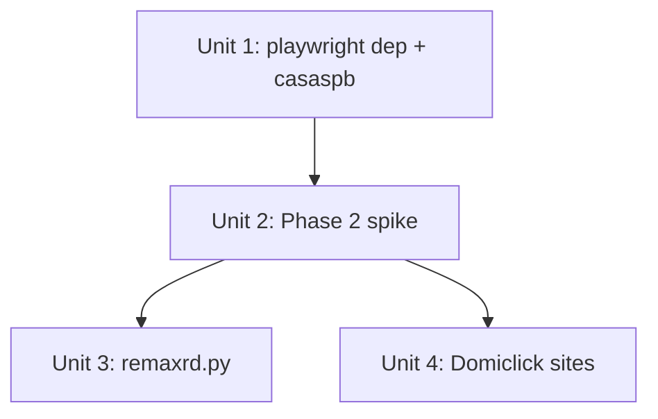

# feat: Add 4 remaining scrapers — casaspb, remaxrd, apartamentosrd, tucasard

## Overview

Completes the aspirational 10-site DR real estate scraper roster. Adds `casaspb.com` (Phase 1,
requests + BeautifulSoup) and three JS-rendered Phase 2 sites (remaxrd.com,
apartamentosrd.com.do, tucasard.com) using the Playwright Python sync API. All new modules
conform to the existing `scrape() → list[dict]` interface and land in the `REGISTRY` in
`scraper/__main__.py`.

## Problem Frame

6 of 10 aspirational sites are working. The remaining 4 were deferred: `casaspb.com` held as a
trivial EasyBroker clone, and 3 Next.js / Domiclick sites requiring headless browser rendering.
Adding these sites expands the training corpus available to `ml/train.py`. (see origin:
`docs/brainstorms/2026-04-10-remaining-scrapers-requirements.md`)

## Requirements Trace

- R1. `scraper/sites/casaspb.py` — EasyBroker pattern, selectors from spike
- R2. `casaspb` wired into REGISTRY
- R3. `playwright` added to `requirements.txt`
- R4. `scraper/sites/remaxrd.py` — Playwright sync API, selectors from spike
- R5. `scraper/sites/apartamentosrd.py` + `scraper/sites/tucasard.py` — Domiclick platform,
  shared helper if structurally identical
- R6. `remaxrd`, `apartamentosrd`, `tucasard` wired into REGISTRY
- R7. All `scrape()` functions return `list[dict]` with keys:
  `price`, `sector`, `property_type`, `bedrooms`, `area_m2`, `source_url`
- R8. `time.sleep(1)` between pages in Playwright scrapers
- R9. Scraper failures caught by registry dispatcher in `cmd_scrape()`; run continues

## Scope Boundaries

- No changes to `ml/train.py`, `api.py`, or the 5-field DB schema
- No headless browser on EC2 — scraping is local developer workflow only
- No new training-feature fields; `source_url` is existing DB field
- No scrape scheduling or automation
- DOP/RD$ listings skipped across all new sites

## Context & Research

### Relevant Code and Patterns

- `scraper/sites/miscasasrd.py` — canonical EasyBroker Phase 1 pattern; casaspb uses the same
  platform with different selectors. Follow `_fetch_page()`, `_parse_bedrooms()`,
  `_parse_area()`, `_infer_property_type()`, and `scrape()` structure exactly.
- `scraper/scraper.py:parse_price_usd()` — shared USD price parser; all new scrapers import
  and call this function for price filtering. **Do not use `parse_listing()` from this module
  as a dict template — it returns only 5 keys (no `source_url`) and will cause
  `insert_listings()` to raise `ValueError`. Use `scraper/sites/miscasasrd.py` as the
  reference implementation (returns all 6 required keys).**
- `scraper/__main__.py` — REGISTRY dict and `cmd_scrape()` resilience loop. All site-level
  exceptions are caught at the registry dispatcher; individual `scrape()` functions do not
  need top-level try/except — let exceptions propagate to the caller.
- `scraper/db.py:REQUIRED_KEYS` — `{'price', 'sector', 'property_type', 'bedrooms',
  'area_m2', 'source_url'}`. `insert_listings()` raises `ValueError` on any missing or extra
  key. Every new scraper must return exactly these 6 keys.
- `tests/test_sites_supercasas.py` — HTML fixture + `unittest.mock.patch` pattern for
  unit-testing scrapers without live network. Follow this pattern for all new site tests.
- `docs/plans/spike-results.md` — Phase 1 selectors for casaspb confirmed; Phase 2 selectors
  to be documented in Unit 2.

### Institutional Learnings

- `docs/solutions/runtime-errors/supercasas-stale-css-selectors-2026-04-09.md` — DOM drift
  affects any site scraper; document the spike date in each new scraper module.
- `docs/solutions/logic-errors/indominicana-area-sector-parsing-bugs-2026-04-09.md` — two
  lessons relevant here: (1) `get_text(strip=True)` without `separator` prevents `m<sup>2</sup>`
  splitting; (2) filter empty strings after `split(',')`.

## Key Technical Decisions

- **Playwright HTML → BeautifulSoup (not Playwright selectors)**: For each Phase 2 scraper,
  use `page.content()` to get the fully-rendered HTML, then parse with BeautifulSoup. This
  keeps the parsing layer consistent with all existing scrapers and makes parsing functions
  fully testable with HTML fixture strings — no Playwright mocking needed in unit tests.

- **`_parse_listings(html: str) -> list` extracted function**: Each Phase 2 scraper module
  exposes a `_parse_listings(html)` helper that takes a raw HTML string and returns the list.
  `scrape()` calls Playwright to obtain HTML per page, then calls `_parse_listings()`. Unit
  tests target `_parse_listings()` directly with fixture HTML.

- **`page.set_default_timeout(30_000)`**: Set on every Playwright page before navigation to
  bound stalled JS renderers at 30 s. Without this, a hung spinner blocks the entire scrape
  run indefinitely.

- **`wait_until='networkidle'`**: Use `page.goto(url, wait_until='networkidle')` for all
  Phase 2 sites so client-side data is fully populated before `page.content()` is called.
  Sites with heavy SPAs may need `'domcontentloaded'` as a fallback if `'networkidle'` times
  out consistently.

- **Domiclick shared helper — conditional extraction**: Do not pre-abstract. Implement
  `apartamentosrd.py` fully first. Only after the Unit 2 spike confirms that tucasard.com
  has the same rendered card structure, extract a shared `scraper/sites/_domiclick.py` helper
  parameterised by `base_url`. If tucasard diverges, implement it independently.

- **casaspb sector parsing — split on comma**: The spike records the location text as
  `"Apartamento en Playa Cosón, Las Terrenas"`. Apply: strip any leading `"PropertyType en "`
  prefix via regex, then split on `", "` and take the first non-empty segment as `sector`.
  During implementation, check whether casaspb cards carry a `data-popover-data` JSON
  attribute (same as miscasasrd); if present, use `json.loads(card['data-popover-data'])` for
  a cleaner extraction path.

- **Resilience handled at registry level**: `cmd_scrape()` already wraps each
  `site_module.scrape()` call in `try/except Exception`. New scrapers do not need their own
  top-level exception handling — let page/network errors propagate naturally to the caller.

## Open Questions

### Resolved During Planning

- **Playwright architecture (sync vs async)**: Sync API chosen — the scraper is a CLI tool
  with no existing async context. The sync API is safe here and avoids `asyncio` complexity.
- **Test strategy for Playwright scrapers**: Extract `_parse_listings(html)` from the Playwright
  fetch layer; test this function with HTML fixtures. No Playwright mocking needed in unit tests.
- **Domiclick factoring**: Conditional on structural identity confirmed in Unit 2 spike.
- **casaspb sector**: Parsing rule documented above; `data-popover-data` check deferred to
  implementation once a live page is inspected.
- **R9 resilience contract**: The registry's `cmd_scrape()` already provides this — new scrapers
  need not replicate it. "Same resilience contract" means: let exceptions propagate, the
  registry loop logs them and continues.

### Deferred to Implementation

- **Phase 2 CSS selectors and pagination mechanism**: Unknown until Unit 2 spike runs against
  live sites. Selectors, per-page card counts, and pagination approach (URL-param, click-based,
  or infinite-scroll) are all implementation-time discoveries.
- **Bot-detection status**: Each Phase 2 site may block headless Playwright. If blocked,
  demote the site to a REGISTRY comment (Phase 2 → Blocked) and reduce the success criterion
  accordingly. This is a binary gate resolved at the start of Unit 2.
- **casaspb `data-popover-data` presence**: Check during Unit 1 implementation; use it if
  present, fall back to caption-text parsing if absent.
- **tucasard structural identity**: Confirm rendered card structure matches apartamentosrd
  before extracting shared helper. If diverged, implement tucasard independently.
- **`wait_until` fallback per site**: If `networkidle` times out on a specific Phase 2 site,
  fall back to `'domcontentloaded'` and add an explicit `page.wait_for_selector()` call.

## High-Level Technical Design

> *This illustrates the intended approach and is directional guidance for review, not
> implementation specification. The implementing agent should treat it as context, not code
> to reproduce.*

**Phase 1 scraper architecture (casaspb — same as existing sites):**

```
requests.get(url) → HTML string → BeautifulSoup → parse cards → list[dict]
```

**Phase 2 scraper architecture (Playwright sites):**

```
sync_playwright() context
  └─ browser = p.chromium.launch(headless=True)
       └─ page = browser.new_page()
            └─ page.set_default_timeout(30_000)
            └─ for each page URL:
                 page.goto(url, wait_until='networkidle')
                 html = page.content()           ← rendered HTML
                 listings += _parse_listings(html)  ← same BS parsing as Phase 1
                 time.sleep(1)
  └─ browser.close()
```

**Module structure for each Phase 2 site:**

```
scraper/sites/remaxrd.py
  _parse_listings(html: str) -> list[dict]   ← testable with fixtures
  scrape(max_pages: int = 50) -> list[dict]  ← calls Playwright, calls _parse_listings
```

**Domiclick shared helper (conditional on structural identity confirmed in Unit 2):**

```
scraper/sites/_domiclick.py
  scrape_domiclick(base_url: str, max_pages: int) -> list[dict]

scraper/sites/apartamentosrd.py
  scrape() → calls scrape_domiclick('https://www.apartamentosrd.com.do')

scraper/sites/tucasard.py
  scrape() → calls scrape_domiclick('https://www.tucasard.com')
```

## Implementation Units



---

- [ ] **Unit 1: Playwright dependency + casaspb.py**

**Goal:** Add `playwright` to `requirements.txt` and implement the casaspb.com EasyBroker
scraper. Wire `casaspb` into the REGISTRY.

**Requirements:** R1, R2, R3

**Dependencies:** None

**Files:**
- Modify: `requirements.txt`
- Create: `scraper/sites/casaspb.py`
- Modify: `scraper/__main__.py`
- Create: `tests/test_sites_casaspb.py`
- Modify: `README.md` (add `playwright install chromium` to local setup steps)

**Approach:**
- Add `playwright` (unversioned — take latest compatible) to `requirements.txt`
- Model `casaspb.py` directly on `scraper/sites/miscasasrd.py`. The site runs the same
  EasyBroker platform; replace the selectors and base URL constants only:
  - `CASASPB_BASE = 'https://www.casaspb.com'`
  - `LISTING_URL_PAGE = '.../properties?page={page}&web_page=properties'`
  - `CARD_SELECTOR = 'div.thumbnail'`
  - `PRICE_SELECTOR = 'span.listing-type-price'`
  - Anchor: `a.related-property[href*="/property/"]`
- Sector extraction: before using `div.caption > span` text, check whether the card element
  carries a `data-popover-data` attribute. If it does, parse the JSON and extract the
  `"location"` key (same as miscasasrd). If absent, apply: strip `"PropertyType en "` prefix
  via regex `r'^[A-Za-z]+ en '`, then split on `", "` and take the first non-empty segment.
- Reuse `parse_price_usd`, `_parse_bedrooms`, `_parse_area`, `_infer_property_type` — either
  import from `scraper.scraper` (for price) or copy the local helpers from `miscasasrd.py`.
- Add `'casaspb': casaspb` to REGISTRY, removing the deferred comment

**Patterns to follow:**
- `scraper/sites/miscasasrd.py` — full scraper structure
- `tests/test_sites_supercasas.py` — HTML fixture test pattern

**Test scenarios:**
- Happy path: USD card with `span.listing-type-price "$420,000 USD"`, `a.related-property`,
  bedrooms, and area → `scrape()` returns list with one dict containing all 6 required keys,
  `source_url` starts with `https://www.casaspb.com`
- DOP filter: card with `"RD$ 5,900,000 DOP"` price → skipped, not in results
- Missing bedrooms: card without hab/bed indicator → skipped
- Missing area: card without m²/mt2 text → skipped
- Sector extraction: `div.caption > span` text `"Apartamento en Playa Cosón, Las Terrenas"` →
  strip prefix → `"Playa Cosón, Las Terrenas"` → first non-empty segment → `sector` is `"Playa Cosón"`
- Empty page: page with no `div.thumbnail` cards → `scrape()` returns `[]` and stops early
- Two-page scrape: first page has cards, second page is empty → stops after second page,
  returns only first-page results; `time.sleep` called once

**Verification:**
- `pytest tests/test_sites_casaspb.py` — all scenarios pass without network calls
- `from scraper.sites.casaspb import scrape` imports without error
- casaspb appears in REGISTRY: `python -c "from scraper.__main__ import REGISTRY; print(list(REGISTRY.keys()))"`

---

- [ ] **Unit 2: Phase 2 connectivity spike**

**Goal:** Run Playwright against all 3 Phase 2 sites to discover CSS selectors, pagination
mechanism, and bot-detection status. Document findings. Gate Units 3 and 4.

**Requirements:** R4, R5 (prerequisite)

**Dependencies:** Unit 1 (playwright installed and `playwright install chromium` run)

**Files:**
- Modify: `docs/plans/spike-results.md` (append Phase 2 section)

**Approach:**
- For each site (remaxrd.com/propiedades, apartamentosrd.com.do, tucasard.com):
  1. Launch headless Chromium, navigate, set `wait_until='networkidle'`
  2. Check if listing cards render — if the page loads but shows 0 cards after 10 s, try
     `'domcontentloaded'` + `page.wait_for_selector(card_selector, timeout=10_000)`
  3. If a CAPTCHA or bot block is detected (page text contains "robot", "captcha", or returns
     a non-listing page): demote that site to "Blocked" in the spike notes. Do NOT implement
     its module in Units 3/4. Update its REGISTRY comment to `# Phase 2 → Blocked`.
  4. For each site that loads: document card selector, price selector, sector selector,
     bedrooms/area selectors, and pagination URL pattern or click-target
  5. For tucasard.com: explicitly compare rendered card HTML against apartamentosrd.com.do to
     confirm or deny structural identity. Note any differences.
- Update `docs/plans/spike-results.md` with "Phase 2 — Playwright Spike (2026-04-10)" section
  following the same format as the Phase 1 entries. For each site, record:
  - Whether `wait_until='networkidle'` reliably resolves within 30 s (required field)
  - If not, the CSS card selector to use with `page.wait_for_selector()` as fallback
  This is a required spike output — not an open implementation-time decision

**Test expectation:** none — this is an exploratory spike, not a feature unit

**Verification:**
- `docs/plans/spike-results.md` updated with per-site selectors (or Blocked status)
- Any blocked sites have their REGISTRY comment updated before beginning Unit 3/4

---

- [ ] **Unit 3: remaxrd.py Playwright scraper**

**Goal:** Implement the remaxrd.com scraper using Playwright sync API + BeautifulSoup parsing.
Wire into REGISTRY.

**Requirements:** R4, R6, R7, R8, R9

**Dependencies:** Unit 2 (selectors and pagination documented; site confirmed not blocked)

**Files:**
- Create: `scraper/sites/remaxrd.py`
- Modify: `scraper/__main__.py`
- Create: `tests/test_sites_remaxrd.py`

**Approach:**
- Structure: `_parse_listings(html: str) -> list[dict]` + `scrape(max_pages: int = 50) -> list`
- In `scrape()`, use the `sync_playwright()` context manager. Open one browser instance per
  call; open one page; set `page.set_default_timeout(30_000)`.
- Navigate to each page URL (or use pagination mechanism from Unit 2 spike). After
  `page.goto(url, wait_until='networkidle')`, call `page.content()` to get rendered HTML and
  pass it to `_parse_listings()`. Call `time.sleep(1)` after each page.
- Exit the page loop when `_parse_listings(html)` returns an empty list (no cards found).
- In `_parse_listings()`: parse with `BeautifulSoup(html, 'html.parser')`, apply selectors
  from spike, call `parse_price_usd()`, apply field-completeness checks. Return only dicts
  with all 6 keys populated. Sector: use the spike-discovered location selector; if the text
  contains a comma, take the first non-empty segment (consistent with indominicana fix pattern)
- Wire `import scraper.sites.remaxrd as remaxrd` and `'remaxrd': remaxrd` in REGISTRY,
  replacing the Blocked comment.

**Patterns to follow:**
- `scraper/sites/miscasasrd.py` — overall structure and parsing helpers
- High-Level Technical Design above — Playwright fetch loop shape

**Test scenarios:**
- Happy path: `_parse_listings(HTML_WITH_USD_CARD)` returns one dict with all 6 keys populated
- DOP filter: `_parse_listings(HTML_WITH_DOP_CARD)` returns `[]`
- Missing field: card without bedrooms indicator → listing skipped
- Missing area: card without m²/mt2 → listing skipped
- Empty page: `_parse_listings(HTML_EMPTY_PAGE)` returns `[]`
- Multi-card page: page with 2 USD cards and 1 DOP card → returns 2 dicts
- `source_url` is absolute and starts with `https://www.remaxrd.com` (or the site's base URL)

**Verification:**
- `pytest tests/test_sites_remaxrd.py` — all scenarios pass without network calls
- remaxrd appears in REGISTRY: confirmed via import check

---

- [ ] **Unit 4: Domiclick sites — apartamentosrd.py + tucasard.py**

**Goal:** Implement apartamentosrd.com.do and tucasard.com. If Unit 2 confirmed structural
identity, extract shared helper `scraper/sites/_domiclick.py`. If diverged, implement both
independently.

**Requirements:** R5, R6, R7, R8, R9

**Dependencies:** Unit 2 (Domiclick selectors documented; structural identity confirmed or
denied)

**Files:**
- Create: `scraper/sites/apartamentosrd.py`
- Create: `scraper/sites/tucasard.py`
- Create (conditional): `scraper/sites/_domiclick.py` — only if structurally identical
- Modify: `scraper/__main__.py`
- Create: `tests/test_sites_apartamentosrd.py`
- Create: `tests/test_sites_tucasard.py`

**Approach:**

*If Unit 2 confirmed structural identity (same rendered card DOM):*
- Create `scraper/sites/_domiclick.py` with:
  - `_parse_listings(html: str) -> list[dict]` — all BS parsing logic, selectors from spike
  - `scrape_domiclick(base_url: str, max_pages: int = 50) -> list` — Playwright loop parameterised by `base_url`
- `apartamentosrd.py`: single `scrape()` function that calls
  `_domiclick.scrape_domiclick('https://www.apartamentosrd.com.do')`
- `tucasard.py`: same, with its base URL

*If Unit 2 found diverged DOM:*
- Implement `apartamentosrd.py` as a standalone module following the remaxrd.py pattern
- Implement `tucasard.py` as a standalone module with its own selectors

In both cases, wire `import scraper.sites.apartamentosrd as apartamentosrd` and
`import scraper.sites.tucasard as tucasard` into REGISTRY, removing the deferred comments.

**Patterns to follow:**
- Unit 3 (`remaxrd.py`) — Playwright + `_parse_listings()` structure
- `scraper/sites/miscasasrd.py` — parsing helpers

**Test scenarios (per site, or shared if using `_domiclick.py`):**
- Happy path: `_parse_listings(HTML_USD_CARD)` (or `_domiclick._parse_listings()`) → dict
  with all 6 keys, `source_url` starts with the correct base URL
- DOP filter: `_parse_listings(HTML_DOP_CARD)` → `[]`
- Missing bedrooms → listing skipped
- Missing area → listing skipped
- Empty page → `[]`
- tucasard: same HTML fixtures work against the `_domiclick` helper if shared

**Verification:**
- `pytest tests/test_sites_apartamentosrd.py tests/test_sites_tucasard.py` — all pass
- Both sites in REGISTRY
- `python -m scraper` with all 4 sites wired outputs "Scraped 10 of 10 sites; 0 failed."
  on a clean network run

---

## System-Wide Impact

- **Interaction graph:** `cmd_scrape()` iterates REGISTRY; adding 4 sites increases
  `sites_attempted` from 6 to 10. The `f'Scraped {sites_succeeded} of {sites_attempted} sites;
  {sites_failed} failed.'` output string changes automatically — no code change needed.
- **Error propagation:** Playwright scrapers propagate exceptions to `cmd_scrape()`'s
  `try/except` block, which logs at error level and increments `sites_failed`. This is
  identical to the existing Phase 1 resilience contract.
- **State lifecycle risks:** Each Playwright `scrape()` call opens and closes its own browser
  instance. No shared browser state between sites. No risk of cross-site contamination.
- **API surface parity:** `scraper/db.py:REQUIRED_KEYS` unchanged; all new scrapers must
  return exactly those 6 keys.
- **Integration coverage:** After all units complete, run `python -m scraper` against live
  sites (not mocked) as a final integration check. Then `python -m scraper export` and
  `python -m ml.train` to confirm the full pipeline continues to work.
- **Unchanged invariants:** `ml/train.py`, `api.py`, `scraper/db.py` schema, and the 5 CSV
  training columns are not touched by this plan.
- **EC2 impact:** `playwright` package will be installed on EC2 via `requirements.txt`. The
  package is safe to import without browser binaries; browser binaries are never installed on
  EC2. Verify by checking that `import playwright` at the Python REPL (without running
  `playwright install`) does not raise on a fresh Ubuntu 22.04 environment.

## Risks & Dependencies

| Risk | Mitigation |
|------|------------|
| Phase 2 site blocks headless Playwright (CAPTCHA, bot detection) | Unit 2 spike is the gate. Demote blocked sites immediately; do not implement their modules. Accept a lower success criterion (e.g., "8 of 10 sites") if 1-2 are blocked. |
| Playwright `networkidle` timeout on a JS-heavy page | Set `page.set_default_timeout(30_000)`; fall back to `wait_until='domcontentloaded'` + `page.wait_for_selector(card_selector)` per site. |
| Domiclick DOM diverges between apartamentosrd and tucasard | Conditional helper decision in Unit 4. Implement independently if diverged; no refactoring needed. |
| casaspb DOM has drifted since 2026-04-08 spike | Verify selectors during Unit 1 implementation before writing tests (quick live check). |
| `playwright` on EC2 causes unexpected import errors | Run `python -c "import playwright"` in a clean venv without browser binaries before merging. |
| Playwright `sync_playwright()` called from async context (future) | Document in `scraper/sites/remaxrd.py` and `_domiclick.py` docstrings that the sync API requires a non-async caller. |

## Documentation / Operational Notes

- Add a note to `docs/plans/spike-results.md` with the Phase 2 spike date and selectors
  (Unit 2 output). This keeps the spike doc the single source of truth for all site selectors.
- Run `playwright install chromium` once after `pip install -r requirements.txt`. Document
  this as a one-time local setup step (e.g., in `README.md` or a developer setup doc) so new
  contributors do not hit a confusing runtime error on first scrape.
- After all 4 sites are wired and tested, create a `docs/solutions/` entry documenting the
  Playwright scraper architecture and the `_parse_listings()` testability pattern.

## Sources & References

- **Origin document:** [docs/brainstorms/2026-04-10-remaining-scrapers-requirements.md](docs/brainstorms/2026-04-10-remaining-scrapers-requirements.md)
- Phase 1 spike results: `docs/plans/spike-results.md`
- Reference scraper: `scraper/sites/miscasasrd.py`
- Registry / resilience: `scraper/__main__.py:cmd_scrape()`
- DB interface: `scraper/db.py:REQUIRED_KEYS`
- Test pattern: `tests/test_sites_supercasas.py`
- Sector parsing lessons: `docs/solutions/logic-errors/indominicana-area-sector-parsing-bugs-2026-04-09.md`
