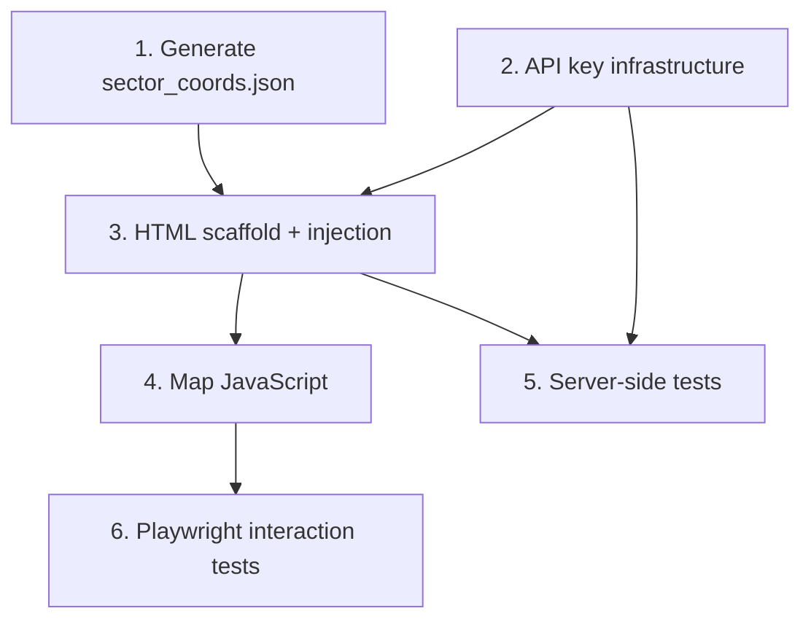

# feat: Add Google Maps sector selection panel

## Overview

Add a bidirectional Google Maps panel below the prediction form. When the user selects a sector
from the datalist, the map pans to and highlights that sector's pin. When the user clicks a pin,
the sector input is filled with that sector's name. The map always shows all known sectors as
pins centered on Santo Domingo, DR.

## Problem Frame

Users unfamiliar with Santo Domingo neighborhoods have no visual reference when entering a
sector. The existing datalist surfaces all known sector names as autocomplete options but gives
no spatial context. A map panel lets users orient geographically and select by clicking rather
than typing.
(see origin: docs/brainstorms/2026-04-11-sector-map-requirements.md)

## Requirements Trace

**Visual / Layout**
- R1. Map card always visible below the form card on page load.
- R4. Selected sector's pin is visually distinct from unselected pins.

**Initialization**
- R2. Map initializes centered on Santo Domingo; if sector input is pre-filled on load, map initializes on that sector's pin instead.
- R3. Each known sector with a resolvable coordinate has a pin; sectors without are silently omitted.

**Interaction — Form → Map**
- R5. Sector input `change` → map pans and highlights pin (exact, case-sensitive match against canonical sector names; the datalist always supplies canonical casing, so manual typed values that don't exactly match fall to R6). If matched sector has no coordinate, R6 behavior applies.
- R6. Sector cleared, unrecognized, or non-exact match → map returns to Santo Domingo overview, all pins unselected.
- R7. "Fill randomly" button updates the map alongside the form.

**Interaction — Map → Form**
- R8. Clicking a pin fills the sector input with the sector's name and moves focus to the sector
  input (so the user can immediately proceed to fill the rest of the form). Clicking the
  already-selected pin is a no-op — pin stays highlighted, input unchanged.

**Data & Infrastructure**
- R9. Sector coordinates are pre-baked in `static/sector_coords.json`; no geocoding at runtime.
- R10. Maps API key injected server-side (not committed to source). `MAPS_MAP_ID` also injected for `AdvancedMarkerElement`.

**Error Handling**
- R13. Map card shows error message if SDK fails to load; sector input remains functional.

> Note: R11 and R12 are intentionally unassigned in this plan. R11 was an out-of-scope carry-over
> from the S3 plan. R12 was not allocated. R13 numbering is inherited from the brainstorm document.

**Success criteria:**
- Once map has loaded, sector selection pans to pin synchronously (no additional API calls).
- Clicking any pin fills sector input correctly and highlights the pin.
- "Fill randomly" updates both form and map.
- On mobile, map is usable without horizontal scroll; scroll-trap is prevented.
- No Google Maps API calls are made at runtime beyond initial tile load.

## Scope Boundaries

- No sector polygon boundaries — point pins only.
- No map-based filtering or price browsing.
- No runtime geocoding API calls — coordinates are pre-baked.
- No change to prediction logic or `/predict` endpoint.
- `google.maps.Marker` (deprecated Feb 2024) is not used — `AdvancedMarkerElement` only.
- Coordinate file generated once offline; update lifecycle is a follow-up concern (see Risks).

## Context & Research

### Relevant Code and Patterns

- `api.py:77` — SECTORS injection pattern: `_PAGE_HTML` contains `__SECTORS__` placeholder;
  `index()` route replaces it with `json.dumps(sectors)`. Same pattern for `__MAPS_API_KEY__`,
  `__MAPS_MAP_ID__`, and `__SECTOR_COORDS__`.
- `api.py:143-159` — lifespan context: `known_sectors` extracted from encoder categories at
  startup. Coordinate file must use the same exact strings as keys.
- `static/main.js:134-150` — `fillRandom()` sets `document.getElementById('sector').value`
  programmatically. Programmatic assignment does NOT fire `change`/`input` events in standard
  browsers, so `fillRandom()` must call `updateMapForSector(name)` directly.
- `static/main.js:1` — IIFE wrapper `(function() { 'use strict'; ... }())`. All code is
  function-scoped. `initMap` must be a named global (attached to `window`) to serve as the
  Maps SDK callback.
- `static/style.css:9` — `main { max-width: 640px; margin: 0 auto; }` — all cards constrained
  to 640px. Map card sits within this column.
- `static/style.css:20-25` — `.card` class: white background, border-radius 10px, box-shadow.
  Map card reuses this class.
- `static/style.css:106-110` — single responsive breakpoint at `max-width: 479px`.
- `tests/test_api.py:156-212` — existing HTML injection tests check for `__SECTORS__` absent,
  known sector values present, link hrefs/src. Same pattern for map-related assertions.
- `deploy/supervisor.conf` — currently no `environment=` directive. `templatefile()` in
  Terraform generates a `.tpl`-rendered version that adds `GOOGLE_MAPS_API_KEY` and
  `MAPS_MAP_ID`.
- `docs/solutions/runtime-errors/scikit-learn-pickle-version-mismatch-2026-04-05.md` —
  supervisor `autorestart=true` masks crash loops. Always verify in `stderr.log` when the
  health check fails after a Terraform deploy that adds new env vars.

### Institutional Learnings

- No existing Maps or env-var injection learnings — this is clean-slate territory in this repo.
- Supervisor `autorestart=true` hides startup failures — a misconfigured `environment=`
  directive (typo, unescaped char) will appear as `RUNNING` in `supervisorctl status` while
  crashing in a loop. Always check `/var/log/predict-api/stderr.log` after deploying env changes.

### External References

- [Maps JS API: Load the SDK](https://developers.google.com/maps/documentation/javascript/load-maps-js-api) — legacy callback pattern still valid
- [AdvancedMarkerElement reference](https://developers.google.com/maps/documentation/javascript/reference/advanced-markers) — requires `mapId`
- [Migrate to Advanced Markers](https://developers.google.com/maps/documentation/javascript/advanced-markers/migration)
- [gestureHandling: cooperative](https://developers.google.com/maps/documentation/javascript/interaction)
- [Error handling / gm_authFailure](https://developers.google.com/maps/documentation/javascript/error-handling)
- [API Security Best Practices](https://developers.google.com/maps/api-security-best-practices) — referrer restriction
- [Billing: Maps JS Dynamic Maps SKU](https://developers.google.com/maps/billing-and-pricing/pricing) — Essentials tier, 10,000 free loads/month (as of March 2025)

## Key Technical Decisions

- **Legacy `async defer callback=initMap` SDK loading over the inline bootstrap loader**:
  The bootstrap loader is recommended for new projects but embeds the API key in inline JS,
  complicating the `__MAPS_API_KEY__` placeholder injection pattern. The legacy script-tag
  approach puts the key in the `src` URL, which is a trivial string replacement in
  `_PAGE_HTML`. Both patterns are supported; legacy is simpler for this architecture.

- **`AdvancedMarkerElement` over deprecated `google.maps.Marker`**:
  `google.maps.Marker` was deprecated February 2024 and will eventually be removed.
  `AdvancedMarkerElement` is the current API. It requires a `mapId` on the Map instance,
  which means a second config variable (`MAPS_MAP_ID`) alongside the API key.

- **Custom div pin content over `PinElement` for selected/unselected states**:
  Custom div elements (small circle for unselected, larger circle in accent color for selected)
  avoid importing the `PinElement` class and keep styling purely in CSS via class swaps.

- **`change` event as Form → Map trigger (not `input`)**:
  The `change` event fires on datalist pick and on blur with a changed value — not on every
  keystroke. This prevents map thrashing while the user types. Programmatic `fillRandom()`
  bypasses events and calls `updateMapForSector()` directly.

- **Direct `window.initMap` global for SDK callback**:
  The SDK callback must be a global function name passed as `&callback=initMap`. Because
  `main.js` uses an IIFE that hides everything, `initMap` is assigned to `window.initMap`
  explicitly. `map.js` (new file) defines this global.

- **Terraform `local_file` resource + `templatefile()` for supervisor.conf**:
  The `environment=` directive cannot be injected into the current `supervisor.conf` without
  either modifying the committed file on every deploy (fragile) or templating it (durable).
  There is no existing env var mechanism in this Terraform stack (no Parameter Store, no
  `remote-exec`-level secret passing). The `local_file` + `templatefile()` approach is the
  minimum-complexity path that keeps secrets out of source control, uses infrastructure
  Terraform already controls, and doesn't require a new AWS service (SSM, Secrets Manager).
  It adds one new file (`supervisor.conf.tpl`) and one Terraform resource — proportionate to
  R10's scope.

- **Sector coordinate keys must exactly match encoder category strings**:
  `SECTORS` (and the coordinate lookup) are keyed by the exact strings from
  `artifact['encoder'].named_transformers_['cat'].categories_[0]`. The geocoding script must
  read these strings directly from `ml/model.pkl` — not from a separately curated list — to
  guarantee string identity.

## Open Questions

### Resolved During Planning

- **How is the Maps API key stored and injected server-side?**
  Terraform `sensitive` variable → `local_file` + `templatefile()` renders
  `deploy/supervisor.conf.tpl` → EC2 process inherits `GOOGLE_MAPS_API_KEY` env var →
  `api.py` reads via `os.getenv('GOOGLE_MAPS_API_KEY', '')` → injected into `_PAGE_HTML`
  via `__MAPS_API_KEY__` placeholder.

- **What is the pan trigger event?**
  The sector input's `change` event. Fires on datalist selection and on blur with changed
  value; does not fire on every keystroke. `fillRandom()` and `clearForm()` call
  `updateMapForSector()` / `resetMap()` directly without relying on events.

- **Map height and responsive behavior?**
  Map container: `height: 350px` on desktop; `height: 260px` at the `≤479px` breakpoint.
  Full width of the `.card` container (constrained to 640px by `main`). `gestureHandling:
  'cooperative'` prevents scroll-trap on mobile.

- **What happens when the Maps SDK fails to load?**
  `window.gm_authFailure` callback and a `try/catch` around `initMap` both display a fallback
  message inside the map card: "Map unavailable — use the text field to enter a sector." The
  sector input remains fully functional.

- **How are sector coordinates sourced?**
  One-time offline script `scripts/generate_sector_coords.py`: loads `ml/model.pkl`, extracts
  `categories_[0]`, calls Google Geocoding API for each sector name with ", Santo Domingo, DR"
  appended, writes results to `static/sector_coords.json`. Script requires a
  `GEOCODING_API_KEY` env var (distinct from the Maps JS key — unrestricted, used once).
  Output is committed to the repo.

- **What is the `gm_authFailure` / SDK failure UX?**
  Resolved: show inline message in map card div, log error. No full-page blocking.

### Deferred to Implementation

- Exact `gestureHandling` overlay message text on desktop — browser-rendered by Maps SDK, no
  control needed.
- Whether a loading skeleton or plain background color is shown while the SDK initializes —
  the map card has `min-height: 350px` so it does not collapse; implementer may add a spinner.
- Whether `DEMO_MAP_ID` or a real Cloud Map ID is used during development — document in
  README or `.env.example`.

## High-Level Technical Design

> *This illustrates the intended approach and is directional guidance for review, not
> implementation specification. The implementing agent should treat it as context, not code
> to reproduce.*

```
Page load sequence
──────────────────
1. Server: api.py index() route
   - Reads MAPS_API_KEY, MAPS_MAP_ID from os.getenv
   - Injects: SECTORS, SECTOR_COORDS, MAPS_API_KEY, MAPS_MAP_ID into _PAGE_HTML

2. Browser: HTML parses
   - Inline scripts set: window.SECTORS, window.SECTOR_COORDS
   - <script async defer ...&callback=initMap> fires SDK load

3. SDK ready: window.initMap() executes (defined in static/map.js)
   - Creates google.maps.Map centered on Santo Domingo
   - For each sector in SECTOR_COORDS: creates AdvancedMarkerElement
   - Stores marker refs in markerMap[sectorName]
   - Wires: sectorInput 'change' event → updateMapForSector()
   - Sets: window.gm_authFailure → showMapError()

Bidirectional sync
──────────────────
Form → Map (R5, R6)
  sectorInput 'change' event fires
    if SECTOR_COORDS[input.value] exists
      panTo(coords), highlight markerMap[input.value], unhighlight previous
    else (unrecognized or empty)
      panTo(defaultCenter), setZoom(defaultZoom), unhighlight all

Map → Form (R8)
  marker click listener fires
    sectorInput.value = markerSectorName
    updateMapForSector(markerSectorName)   // same highlight + pan path

fillRandom() (R7)  [in main.js]
  sectorInput.value = randomSector
  updateMapForSector(randomSector)         // explicit call, not via event

clearForm() (R6)  [in main.js]
  sectorInput.value = ''
  resetMap()                               // pan to default, unhighlight all
```

## Implementation Units



- [ ] **Unit 1: Generate sector coordinate file**

**Goal:** Produce `static/sector_coords.json` — the static sector-name → lat/lng lookup that
powers all map pins. Keys must exactly match encoder category strings.

**Requirements:** R3, R9

**Dependencies:** `ml/model.pkl` must be present locally (it is, per existing model).

**Files:**
- Create: `scripts/generate_sector_coords.py`
- Create: `static/sector_coords.json`

**Approach:**
- Script loads `ml/model.pkl` via `joblib.load`, extracts
  `artifact['encoder'].named_transformers_['cat'].categories_[0].tolist()` — the exact
  sector strings used at prediction time.
- For each sector, calls the Google Geocoding API:
  `query = f"{sector_name}, Santo Domingo, Dominican Republic"`
  Uses `requests.get` with `GEOCODING_API_KEY` env var (distinct key, unrestricted).
- Writes `{ "Piantini": { "lat": 18.47, "lng": -69.93 }, ... }` to
  `static/sector_coords.json`.
- Logs a WARNING for any sector that returned no results or results outside DR lat/lng bounds
  (approx: lat 17.4–19.9, lng -74.5 to -68.3; all longitudes are negative — implement guard
  as `lat_min=17.4, lat_max=19.9, lng_min=-74.5, lng_max=-68.3`).
- Script is run once manually; output is committed to the repo and does not re-run on deploy.
- `GEOCODING_API_KEY` is never committed — used only to run this script.

**Patterns to follow:**
- `ml/train.py` shows how to load `model.pkl` with `joblib.load`.
- `requests` already in `requirements.txt` — no new dependency.

**Test scenarios:**
- Test expectation: none — this is a one-time data generation script, not feature-bearing
  code in the application path. Verify output manually: check `static/sector_coords.json`
  exists, has expected keys matching SECTORS, values within DR bounds.

**Verification:**
- `static/sector_coords.json` exists and is valid JSON.
- Keys in the JSON exactly match the strings in `SECTORS` when injected on the `/` route.
- Any sector with no coordinate is absent from the JSON (not present with `null`).
- Count of entries is ≥ 80% of `len(SECTORS)` (coverage gate).

---

- [ ] **Unit 2: Maps API key infrastructure**

**Goal:** Wire the Maps API key and Map ID through Terraform → supervisor.conf → api.py →
HTML. Establish the env-var pattern that does not currently exist in the codebase.

**Requirements:** R10

**Dependencies:** None (can be done before Unit 1).

**Files:**
- Modify: `terraform/variables.tf`
- Create: `deploy/supervisor.conf.tpl`
- Modify: `terraform/main.tf`
- Modify: `api.py`

**Approach:**
- `terraform/variables.tf`: add two `sensitive = true` variables: `google_maps_api_key` and
  `maps_map_id`. Add `terraform.tfvars.example` with placeholder values and a comment
  explaining where to obtain each.
- `deploy/supervisor.conf.tpl`: copy of `deploy/supervisor.conf` plus one new line:
  `environment=GOOGLE_MAPS_API_KEY="${google_maps_api_key}",MAPS_MAP_ID="${maps_map_id}"`
  (`${...}` is Terraform's `templatefile` interpolation syntax, not shell).
- `terraform/main.tf`: add a `local_file` resource that renders `supervisor.conf.tpl` into
  a temporary file (e.g., `${path.module}/supervisor.conf.rendered`). The existing supervisor
  install uses a `remote-exec` inline script with `sudo cp /home/ubuntu/Project1/deploy/supervisor.conf ...`
  — replace this line to copy from the rendered path instead of the static `deploy/supervisor.conf`.
  Add `supervisor.conf.rendered` to `.gitignore`. Also add `terraform.tfvars` and `*.tfvars`
  (excluding `*.tfvars.example`) to `.gitignore` to prevent accidental secret commits.
- `api.py`: add `import os` at the top. Read `MAPS_API_KEY = os.getenv('GOOGLE_MAPS_API_KEY', '')` and `MAPS_MAP_ID = os.getenv('MAPS_MAP_ID', '')` at module level after existing imports.
  Update `index()` to chain these replacements alongside the existing SECTORS replacement.

**Patterns to follow:**
- `api.py:197` — existing `html = _PAGE_HTML.replace('__SECTORS__', ...)` chain.
- `terraform/main.tf` — existing `remote-exec` inline script that copies `supervisor.conf` to update.
- Supervisor log path from `docs/solutions/runtime-errors/scikit-learn-pickle-version-mismatch-2026-04-05.md`.

**Test scenarios:**
- Happy path: `GET /` with `GOOGLE_MAPS_API_KEY=test-key` env var set → `__MAPS_API_KEY__`
  is absent from response HTML, `test-key` is present in HTML.
- Happy path: `GET /` with `MAPS_MAP_ID=test-map-id` → `__MAPS_MAP_ID__` absent, `test-map-id`
  present.
- Edge case: `GOOGLE_MAPS_API_KEY` not set (empty string) → `GET /` returns 200, HTML
  contains empty string where key would appear (API startup does not crash on missing key —
  missing key is caught at map render time in the browser, not server-side).
- Integration: test fixtures for existing tests must set `GOOGLE_MAPS_API_KEY` in env or mock
  `os.getenv` to avoid `__MAPS_API_KEY__` appearing in test HTML assertions.

**Verification:**
- `terraform plan` shows new variables accepted without errors.
- `api.py` starts cleanly with and without the env vars set.
- `GET /` HTML response does not contain `__MAPS_API_KEY__` or `__MAPS_MAP_ID__` literal strings.

---

- [ ] **Unit 3: HTML scaffold + server-side injection**

**Goal:** Add the map card container, Maps SDK script tag, and SECTOR_COORDS global injection
to `_PAGE_HTML`. Add map card styles to `style.css`.

**Requirements:** R1, R9, R10

**Dependencies:** Unit 2 (MAPS_API_KEY and MAPS_MAP_ID available in `api.py`).

**Files:**
- Modify: `api.py` (`_PAGE_HTML` string, `index()` route)
- Modify: `static/style.css`

**Approach:**
- In `_PAGE_HTML`, after the closing `</div>` of the results div and before `</main>`:
  - Add a `<div class="card" id="map-card">` containing a `<div id="map-container"></div>`.
    The map container should have a CSS loading state (background `#f0f0f0`, centered "Loading map…"
    text) via a `#map-container::before` pseudo-element or a placeholder `<p>` — this prevents
    the card from appearing as blank space while the SDK initializes. The Maps SDK overwrites
    the container's children when it renders, so the loading text disappears automatically.
  - Add `<div id="map-fallback" hidden>Map unavailable — use the text field to enter a sector.</div>` inside the card.
  - Add an inline `<script>` that sets `window.SECTOR_COORDS = __SECTOR_COORDS__; window.MAPS_MAP_ID = "__MAPS_MAP_ID__";`.
    Note: `MAPS_MAP_ID` is a Google-generated opaque ID (alphanumeric, no quotes/special chars) — no
    escaping is needed in practice, but the implementer should verify the value is free of characters
    that would break the inline script before deploying a new Map ID.
  - Add `<script src="/static/map.js"></script>` **before** the Maps SDK tag (so `window.initMap` is defined synchronously before the SDK script executes — prevents a race condition when the SDK is cached and fires its callback before map.js has been parsed).
  - Add the Maps SDK script tag after map.js: `<script async defer src="https://maps.googleapis.com/maps/api/js?key=__MAPS_API_KEY__&callback=initMap"></script>`.
- In `index()`, add replacements for `__SECTOR_COORDS__`, `__MAPS_API_KEY__`, and
  `__MAPS_MAP_ID__` alongside the existing `__SECTORS__` replacement.
  `SECTOR_COORDS` is loaded from `static/sector_coords.json` at startup (read once in
  lifespan, stored in `model_store`).
- In `style.css`: add `#map-container { height: 350px; width: 100%; }` and at the
  `≤479px` breakpoint: `#map-container { height: 260px; }`. Add `.map-fallback` styling
  (muted text, padding). Map card itself uses the existing `.card` class.

**Patterns to follow:**
- `api.py:77` — `__SECTORS__` injection pattern (exact).
- `api.py:143-159` — lifespan for loading coordinate file: use `with open('static/sector_coords.json') as f: sector_coords = json.load(f)` inside the lifespan context manager (not bare `open()`), handle `FileNotFoundError` with a WARNING log (map will have no pins, form still works).
- `static/style.css:106-110` — responsive breakpoint structure.

**Test scenarios:**
- Happy path: `GET /` → `id="map-container"` present in HTML.
- Happy path: `GET /` → `__SECTOR_COORDS__` literal not present in HTML.
- Happy path: `GET /` → `maps.googleapis.com/maps/api/js` present in HTML (SDK script tag).
- Happy path: `GET /` → `src="/static/map.js"` present in HTML.
- Edge case: `static/sector_coords.json` absent at startup → WARNING logged, `SECTOR_COORDS`
  injected as empty object `{}`, `/` route returns 200, map shows no pins but form works.

**Verification:**
- `GET /` renders all map-related HTML elements.
- No `__SECTOR_COORDS__` or `__MAPS_API_KEY__` literal strings in response.
- Page renders without JS errors when opened in a browser (SDK script tag well-formed).

---

- [ ] **Unit 4: Map JavaScript**

**Goal:** Implement `static/map.js` — map initialization, sector pin rendering, bidirectional
sync, SDK failure fallback, and mobile gesture handling.

**Requirements:** R2–R8, R13 (fallback) — R1 is satisfied by Unit 3's HTML scaffold.

**Dependencies:** Unit 3 (map container and globals present in HTML).

**Files:**
- Create: `static/map.js`

**Approach:**
- At the **top level of `map.js`** (outside `window.initMap`), assign `window.gm_authFailure = showMapError`
  immediately — this must be set before the SDK script executes so auth failures during SDK
  initialization are caught. (If placed inside `initMap`, auth failures fire before `initMap`
  runs and the callback is never registered.)
- Assign `window.initMap` as a named global (SDK callback). Inside:
  - Try/catch wrapping all initialization; catch also calls `showMapError()` for non-auth failures.
  - Read `sectorInput.value` at the end of `initMap` — if it matches a known sector (R2),
    call `updateMapForSector()` to initialize the map centered on that pin. The only
    pre-fill source at present is browser autofill; because the SDK callback fires after
    DOM parsing is complete, autofill values are available by the time `initMap` runs.
  - Initialize `new google.maps.Map(#map-container, { center: Santo Domingo, zoom: 11,
    mapId: window.MAPS_MAP_ID, gestureHandling: 'cooperative' })`.
  - For each sector in `window.SECTOR_COORDS`: create an `AdvancedMarkerElement` with a
    custom `<div>` as pin content. Each pin's visible circle (12px unselected, 18px selected)
    must be wrapped in a transparent 44×44px hit-area `<div>` to meet minimum touch target
    size (WCAG 2.5.8). The visible circle is centered within the hit-area div. Store marker
    in `markerMap[sectorName]`. Wire `addListener('click', ...)` → fill input, call
    `updateMapForSector`, then `sectorInput.focus()`.
  - Wire `sectorInput.addEventListener('change', ...)` → `updateMapForSector(input.value)`.
  - Expose `window.updateMapForSector` and `window.resetMap` as globals so `main.js` can
    call them from `fillRandom()` and `clearForm()`.
- `updateMapForSector(name)`: if `markerMap[name]` exists → `map.panTo`, `map.setZoom(14)`,
  swap pin content to selected state (larger visible circle, accent red). Unhighlight previous.
  If `name` equals the currently-selected sector, this is a no-op (R8). If no entry → call `resetMap()`.
- `resetMap()`: `map.panTo(defaultCenter)`, `map.setZoom(11)`, unhighlight all pins.
- Pin content: visible circle — unselected = 12px blue (`#1a6fbd`), selected = 18px accent red
  (`#c0392b`). Hit-area wrapper = transparent 44×44px div, `cursor: pointer`. Color values match
  existing CSS palette.
- **Keyboard navigation:** keyboard-based tab focus onto individual pins is out of scope for this
  plan. The sector text input is the keyboard entry path. The `AdvancedMarkerElement` may receive
  native focus from the Maps SDK; if it does, Enter should fire the click handler naturally via
  the SDK — implementer should verify this works with no extra code, and note if it doesn't.

**Integration with main.js (required changes to `main.js`):**
- In `fillRandom()`, after setting `document.getElementById('sector').value`, add:
  `if (window.updateMapForSector) window.updateMapForSector(sectorValue);`
- In `clearForm()`, after clearing sector input, add:
  `if (window.resetMap) window.resetMap();`
- The `if (window.*)` guards ensure map code degrades gracefully if `map.js` fails to load.

**Patterns to follow:**
- `static/main.js:1` — IIFE structure for `map.js` internal code; `window.initMap` exposed
  explicitly outside the IIFE.
- `static/main.js:134-150` — `fillRandom()` and `clearForm()` to modify.
- Existing CSS color variables: `#1a6fbd` (primary blue), `#c0392b` (error/accent red).

**Test scenarios:**
- No automated JS unit tests (consistent with existing project test approach — project tests
  HTML content via TestClient, not browser JS execution).
- Manual verification scenarios:
  1. Happy path: Select "Piantini" from datalist → map pans to Piantini pin, pin turns red/larger.
  2. Happy path: Click a different pin → sector input fills with new sector name, focus moves to
     input, previous pin reverts to unselected, new pin highlights.
  3. Happy path: Click the already-highlighted pin → no-op (input unchanged, pin stays highlighted).
  4. Happy path: Click "Fill randomly" → map updates to match the random sector.
  5. Happy path: Clear sector input (Clear button) → map returns to Santo Domingo overview.
  6. Edge case: Type a sector not in SECTOR_COORDS (has datalist entry but no coordinate) →
     map returns to overview (R6 fallback).
  7. Edge case: Maps SDK fails to load (disconnect network after page load, or use invalid key)
     → `#map-fallback` message visible, sector input still accepts text, form submits normally.
  8. Mobile: single-finger scroll passes through to the page; two-finger pinch zooms the map.
     Tap on a 12px pin circle (within 44×44px hit area) registers correctly.

**Verification:**
- `static/map.js` file exists and is syntactically valid JS.
- Page loads without JS console errors when `GOOGLE_MAPS_API_KEY` and `MAPS_MAP_ID` are valid.
- All manual scenarios above pass.

---

- [ ] **Unit 5: HTML integration tests**

**Goal:** Extend `tests/test_api.py` with map-related injection assertions. Ensure existing
tests do not break due to new placeholder replacements.

**Requirements:** R1, R9, R10 (verifiable server-side)

**Dependencies:** Units 2 and 3 complete.

**Files:**
- Modify: `tests/test_api.py`

**Approach:**
- The existing `client` fixture patches `api.joblib` and uses `TestClient(app)`. The new
  `GOOGLE_MAPS_API_KEY` and `MAPS_MAP_ID` env vars will be absent in test scope unless set
  — this is fine; the route injects empty strings for missing keys.
- New test group (`test_frontend_map_*`):
  - `GET /` → `id="map-container"` present.
  - `GET /` → `__MAPS_API_KEY__` not in response text.
  - `GET /` → `__SECTOR_COORDS__` not in response text.
  - `GET /` → `maps.googleapis.com/maps/api/js` in response text (SDK script tag injected).
  - `GET /` → `src="/static/map.js"` in response text.
- For the `SECTOR_COORDS` injection test, mock or set up a `sector_coords.json` fixture or
  patch `model_store['sector_coords']` in the fixture (consistent with how `known_sectors`
  is set in the existing mock).
- Existing injection tests (e.g., `assert '"Piantini"' in response.text`) remain unchanged.

**Patterns to follow:**
- `tests/test_api.py:156-212` — existing HTML injection test block (exact pattern to copy).
- `tests/test_api.py:20-42` — `MOCK_ARTIFACT` and fixture structure; add `sector_coords`
  to model_store in the fixture.

**Test scenarios:**
- Happy path: map container div present in rendered HTML.
- Happy path: no unreplaced `__MAPS_API_KEY__` or `__SECTOR_COORDS__` placeholders in HTML.
- Happy path: Maps SDK script tag present in HTML.
- Happy path: `map.js` script tag present in HTML.
- Happy path: existing sector injection test still passes (SECTORS global unaffected).
- Edge case: empty sector_coords (empty dict) → `window.SECTOR_COORDS = {}` in HTML, route
  still returns 200.

**Verification:**
- `pytest tests/test_api.py` passes with zero failures.
- No existing tests break.

---

- [ ] **Unit 6: Playwright interaction tests**

**Goal:** Verify the bidirectional map ↔ form interaction behaviors that cannot be tested via
server-side HTML assertions: pin click fills input (R8), sector change highlights pin (R5),
fill-randomly updates map (R7), and the no-op behavior on re-clicking the selected pin.

**Requirements:** R5, R7, R8

**Dependencies:** Unit 4 complete (map.js functional).

**Files:**
- Create: `tests/test_map_interaction.py` (or add to existing Playwright test file if one exists)

**Approach:**
- Use the Playwright plugin (already installed per `CLAUDE.md`) with the FastAPI app running
  via a local `uvicorn` fixture or `pytest-playwright` with `live_server`.
- Tests require `GOOGLE_MAPS_API_KEY` and `MAPS_MAP_ID` set to real values (or a test key
  restricted to `localhost`) — document in `tests/README.md` or as a skip marker if keys absent.
- Scenarios to automate:

**Test scenarios:**
- Happy path (R8): Page loads → click the pin for a known sector (e.g., `markerMap["Piantini"]`)
  → assert `#sector` input value equals `"Piantini"` and focus is on the sector input.
- Happy path (R5): Set `#sector` input to a known sector value → dispatch `change` event →
  assert the corresponding pin has the selected CSS state (or `aria` attribute if added).
- Happy path (R7): Click "Fill randomly" → assert the sector input value is non-empty and
  `window.updateMapForSector` was called (verifiable via `page.evaluate`).
- Edge case (R8 no-op): Click a pin → click the same pin again → assert input value unchanged
  and no JS errors thrown.
- Edge case (R13): Load page with invalid API key → assert `#map-fallback` is visible and
  `#map-container` is hidden; assert the form still submits successfully.

**Patterns to follow:**
- Playwright plugin conventions from `CLAUDE.md`; check `tests/` for any existing `.py`
  Playwright files to match fixture and assertion style.

**Verification:**
- `pytest tests/test_map_interaction.py` passes when `GOOGLE_MAPS_API_KEY` is set.
- Tests are skipped (not failed) when the env var is absent, so CI passes without a live key.

## System-Wide Impact

- **Interaction graph:** `api.py` index route now reads three globals (previously one);
  `main.js` `fillRandom()` and `clearForm()` are modified to call map globals.
  No callbacks, middleware, or background tasks affected.
- **Error propagation:** Missing `static/sector_coords.json` at startup → WARNING log,
  empty SECTOR_COORDS in HTML, map shows no pins. Missing Maps key → map renders with
  auth error, fallback message shown. Neither failure blocks the prediction form.
- **State lifecycle risks:** `model_store` gains a new `sector_coords` key loaded in
  `lifespan`. If `sector_coords.json` changes after startup, the old data persists until
  restart (acceptable — file is static).
- **API surface parity:** No new API endpoints. `/predict` and `/health` unchanged.
- **Integration coverage:** The Maps SDK is loaded from an external CDN — integration with
  the actual Maps API is not testable in unit tests. The test suite verifies server-side
  HTML injection only. Browser-level testing (pins render, pan works) requires manual
  verification or a future Playwright test.
- **Unchanged invariants:** The `/predict` POST endpoint, `/health`, `/about`, and all
  existing form submission behavior are unaffected. Sector input still accepts any text
  (map is progressive enhancement).

## Risks & Dependencies

| Risk | Mitigation |
|------|------------|
| Supervisor `autorestart` masks crash on missing env var | Check `/var/log/predict-api/stderr.log` after `terraform apply`; add health-check step to docs |
| Maps API key exposed in page source without referrer restriction | **Pre-deployment gate**: restrict key in Google Cloud Console to production domain before using in any live environment. Document in deployment README. |
| Sector coordinate file keys diverge from encoder after retrain | Add startup WARNING log in `api.py` for each sector in `known_sectors` without a coordinate entry. Plan a follow-up to integrate `generate_sector_coords.py` into the retrain pipeline. |
| `google.maps.Marker` deprecation / AdvancedMarkerElement API changes | SDK loaded on `v: "weekly"` channel — this is a moving channel that could introduce silent breaking changes between deploys. Acceptable risk given low traffic; if map breaks in production, pinning to a specific stable version (e.g., `v=3.56`) is a one-line fix in `_PAGE_HTML`. |
| 10,000 free map loads/month threshold (Dynamic Maps SKU, since March 2025) | Estimate: if the app receives <10k page views/month, costs remain within free tier. Add a Google Cloud billing alert at $1 to catch runaway usage early. |
| `MAPS_MAP_ID` Cloud Map ID requires configuration in Google Cloud Console | Document as deployment prerequisite alongside API key; `DEMO_MAP_ID` is acceptable for local development. |

## Documentation / Operational Notes

- **Deployment prerequisites** (document in README or `deploy/DEPLOYMENT.md`):
  1. Create a Google Maps JavaScript API key in Google Cloud Console.
  2. Restrict the key to: HTTP referrers matching `https://<production-domain>/*`, and
     API restriction: Maps JavaScript API only.
  3. Create a Cloud Map ID (Maps > Map Management in Google Cloud Console) for
     `AdvancedMarkerElement` support.
  4. Add a billing alert at $1/month.
  5. Obtain a `GEOCODING_API_KEY` (a separate Google API key restricted to **Geocoding API only**).
     Run `scripts/generate_sector_coords.py` with it as an env var. Commit the output
     `static/sector_coords.json`. **Revoke the `GEOCODING_API_KEY` immediately after the
     script completes** — it is a one-time credential. Do not store it in `.env` files or
     shell history. Pass it inline: `GEOCODING_API_KEY=<key> python scripts/generate_sector_coords.py`
     (the key will not persist in `.env` or `terraform.tfvars`).
  6. Add `google_maps_api_key` and `maps_map_id` to `terraform.tfvars` (not committed; covered
     by `.gitignore`). Do not type these values directly on the command line (shell history risk).
- **Local development**: set `GOOGLE_MAPS_API_KEY` and `MAPS_MAP_ID` in a local `.env` file
  (not committed). `DEMO_MAP_ID` is usable for development without a real Cloud Map ID.
- **Monitoring**: Google Cloud Console Maps API usage dashboard shows map loads per day.
- **Sector coordinate updates**: after a model retrain that adds or removes sectors, re-run
  `scripts/generate_sector_coords.py` and commit the updated `static/sector_coords.json`
  before deploying the new model. The API logs a WARNING at startup for sectors missing
  coordinates, which serves as a reminder.

## Sources & References

- **Origin document:** [docs/brainstorms/2026-04-11-sector-map-requirements.md](docs/brainstorms/2026-04-11-sector-map-requirements.md)
- Relevant code: `api.py` (HTML injection, lifespan), `static/main.js` (fillRandom, clearForm, IIFE pattern), `static/style.css` (card, breakpoints), `tests/test_api.py` (HTML injection tests), `deploy/supervisor.conf`, `terraform/main.tf`, `terraform/variables.tf`
- Related learnings: `docs/solutions/runtime-errors/scikit-learn-pickle-version-mismatch-2026-04-05.md`
- External docs: Google Maps JS API (load, AdvancedMarkerElement, error handling, billing, security)
